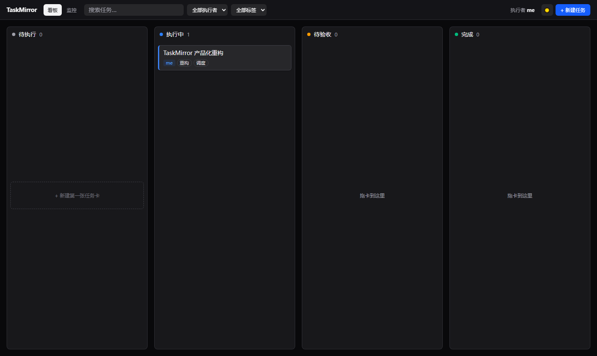
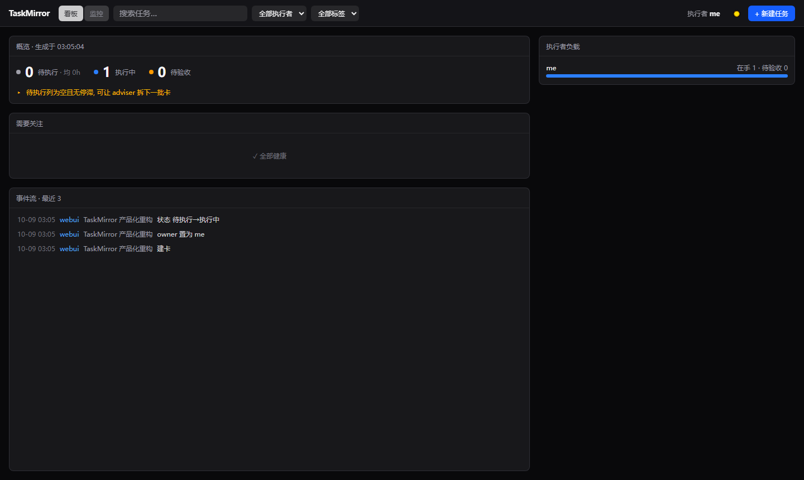

# TaskMirror

**AI agent 原生任务看板**：一个 SQLite 库，两扇门——给人用的网页看板，给 agent 用的 [MCP](https://modelcontextprotocol.io) 服务。agent 建卡/认领/交付，你在浏览器里全程围观。

```
Claude 会话(任意目录) ──stdio MCP──▶ ┌ service.py ── SQLite(WAL) ──┐
浏览器 ──REST + SSE──▶              │      ▶ md 镜像(可 git)        │
(React SPA 由后端托管)              └──────────────────────────────┘
```

Web 与 MCP 是两个独立进程共享同一个库。**Web 服务挂了，agent 照常干活**——MCP 直写 SQLite；`data/tasks/` 下的 md 镜像下次写入时自动重渲染。

[English](README.md)




## 特性

- **看板网页**——暗/亮主题、拖拽排序（dnd-kit）、右侧抽屉（markdown 正文编辑、标签/优先级/截止/颜色）、SSE 实时更新
- **监控 Tab**——执行者负载、停滞卡、各阶段平均停留、实时事件流、规则建议（`GET /api/insights`）
- **8 个 MCP 工具**——`list_tasks` `get_task` `create_task` `take_task`（原子防抢）`update_task` `set_status` `add_log` `get_insights`
- **天生耐久**——WAL + busy_timeout、追加式事件表（进展历史唯一真源）、自动备份（每 50 次写一份、留 20 份）、镜像原子写、JSON 访问日志
- **人读镜像**——每张卡同时是一份纯 markdown，可读/grep/git；DB 为准，镜像是投影
- 可选单 token 鉴权（`TASKBOARD_TOKEN`）、Dockerfile 就位

## 本地跑起来

```bash
git clone <repo> && cd taskmirror
python dev.py setup          # pip install -e backend[dev] + npm ci
python dev.py build          # vite 构建 → 后端托管
python dev.py serve          # http://127.0.0.1:8801
```

给 Claude Code 注册 MCP（Windows）：

```bash
MSYS_NO_PATHCONV=1 claude mcp add taskmirror -s user -- cmd /c <python.exe> <repo>\backend\run_mcp.py
```

Linux/macOS 去掉 `cmd /c`。之后任意会话里说"用 taskmirror 建卡：…"。

## 卡格式

四段式 markdown 正文，agent 直接按段干活：

```
## ① 任务      ← 用户原话，不转述（契约）
## ② 已知事实   ← 直接用，不用重查
## ③ 交付物     ← 做什么才算完
## ④ 注意      ← 红线与坑
```

状态流转：待执行 → 执行中（认领）→ 待验收（交付）→ 完成（验收归档）。执行者只做到待验收，归档是验收方的动作。

## 开发

```bash
python dev.py test           # 后端 pytest + 前端类型检查/构建
python dev.py e2e            # Playwright 全流程冒烟（先 python dev.py build）
python dev.py migrate-legacy "旧tasks目录" [--refresh]   # 导入旧 md 任务卡
python dev.py backup         # 手动备份
```

数据都在 `data/`（已 gitignore）。**在 `data/` 里 `git init` 即可免费获得卡片历史 diff**——镜像目录内容即全部，git log 就是变更史。备份落 `data/backups/`。

## 并发预算（给调度 agent 的话）

GLM/Claude 账户并发请求数有限（比如 4 个）。`/dispatch` 命令的硬规则：同时在途子代理 ≤4（缺省），超出的分波排队；要同时跑 >4 个就把子代理切到更快更便宜的档位。429 / error 1302 = 并发打满 → 排队，不要重试轰炸。

## 许可

[MIT](LICENSE)
